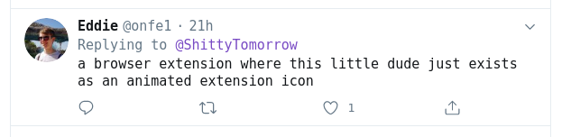

# Catty :cat:

A browser extension that adds an animated cat to your toolbar. That's it.

## Installation

You'll have to add it to your browser manually because I'm not paying the $5.00 google developer registration fee just to publish this to the Chrome Web Store.

As per the instructions [here](https://developer.chrome.com/extensions/getstarted):

1. Open the Extension Management page by navigating to `chrome://extensions`.
   - The Extension Management page can also be opened by clicking on the Chrome menu, hovering over **More Tools** then selecting **Extensions**.
2. Enable Developer Mode by clicking the toggle switch next to **Developer mode**.
3. Click the **LOAD UNPACKED** button and select the extension directory.

## FAQ

1. "Why?" - You, probably.

